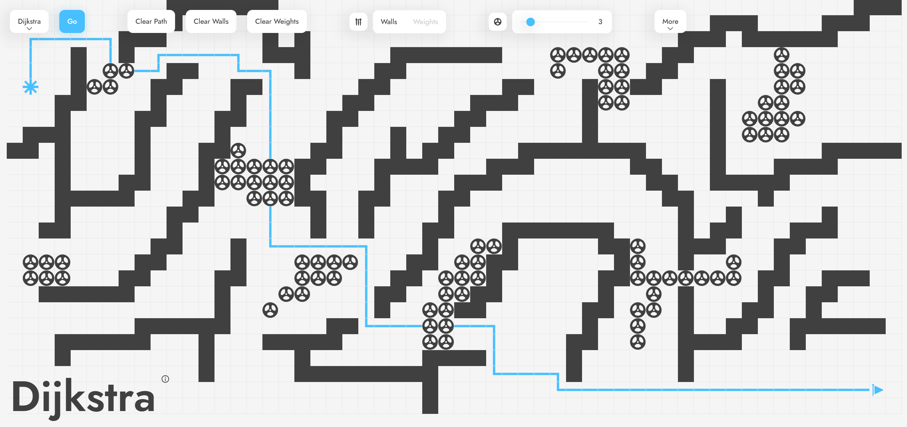

# Pathfinding Visualizer

[🔗 Live Demo](https://allenchung01.github.io/PathfindingVisualizer/)!

<!-- Demo GIF -->
<!--

  

-->

> **⚡ Live Update:** Drag the **start** or **finish** nodes **after** running an algorithm and watch the path **auto-recompute**!

## 🚀 Overview
_Pathfinding Visualizer_ lets you visualize different search algorithms in action. Watch cells light up as they're explored and follow along as a little rocket ships its way to the goal.

## 🔍 Features
- **Algorithms**  
  - Dijkstra  
  - Breadth-First Search (BFS)  
  - Depth-First Search (DFS)  
  - A\*
- **Interactive Controls**  
  - 🎨 Draw **walls** to block cells  
  - ⚖️ Draw **weights** (cost > 1) and tweak their values  
  - 🔄 Drag **start** & **finish** nodes anytime to instantly update the path  
- **Real-Time Visualization**  
  - Cells glow in the order they’re visited  
  - Final path is highlighted and animated by a rocket icon
